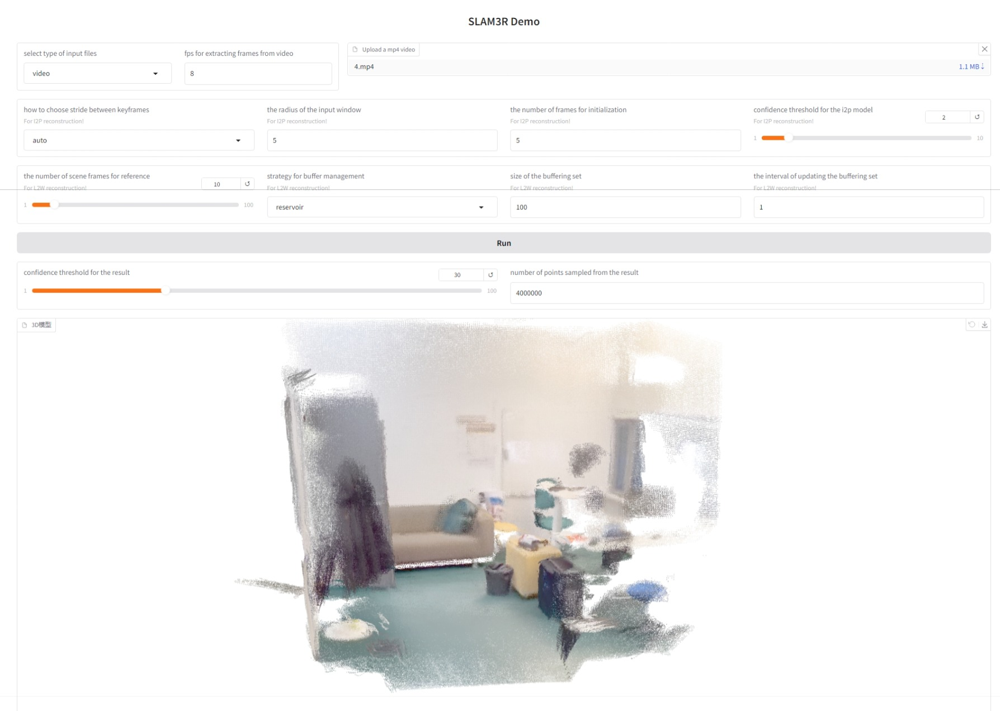

<!-- # SLAM3R    

Paper: [arXiv](http://arxiv.org/abs/2412.09401)

TL;DR: A real-time RGB SLAM system that performs dense 3D reconstruction via points regression with feed-forward neural networks. -->


<p align="center">
  <h2 align="center">SLAM3R: Real-Time Dense Scene Reconstruction from Monocular RGB Videos</h2>
 <p align="center">
    <a href="https://github.com/Ly-kc">Yuzheng Liu*</a>
    ·
    <a href="https://siyandong.github.io/">Siyan Dong*</a>
    ·
    <a href="https://ffrivera0.github.io/">Shuzhe Wang</a>
    ·
    <a href="https://yanchaoyang.github.io/">Yanchao Yang</a>
    ·
    <a href="https://fqnchina.github.io/">Qingnan Fan</a>
    ·
    <a href="https://baoquanchen.info/">Baoquan Chen</a>
  </p>
  <h3 align="center"><a href="https://arxiv.org/abs/2412.09401">Paper</a> | <a href="">Online Demo (Coming Soon)</a> </h3>
  <div align="center"></div>
</p>

<div align="center">
   
  
</div>

<p align="center">
<strong>SLAM3R</strong> is a real-time dense scene reconstruction system that regresses 3D points from video frames using feed-forward neural networks, without explicitly estimating camera parameters. 
</p>
<be>


## TODO List

- [x] Release pre-trained weights and inference code.
- [ ] Release Gradio Demo.
- [ ] Release evaluation code. 
- [ ] Release training code and data.

## Installation

1. Clone SLAM3R
```bash
git clone https://github.com/PKU-VCL-3DV/SLAM3R.git
cd SLAM3R
```

2. Prepare environment
```bash
conda create -n slam3r python=3.11 cmake=3.14.0
conda activate slam3r 
# install torch according to your cuda version
pip install torch==2.5.0 torchvision==0.20.0 torchaudio==2.5.0 --index-url https://download.pytorch.org/whl/cu118
pip install -r requirements.txt
# optional: install additional packages to support visualization
pip install -r requirements_vis.txt
```

3. Optional: Accelerate SLAM3R with XFormers and custom cuda kernels for RoPE
```bash
# install XFormers according to your pytorch version, see https://github.com/facebookresearch/xformers
pip install xformers==0.0.28.post2
# compile cuda kernels for RoPE
cd slam3r/pos_embed/curope/
python setup.py build_ext --inplace
cd ../../../
```

4. Download the SLAM3R checkpoints for the Image-to-Points and Local-to-World models from Hugging Face 

```bash
from huggingface_hub import hf_hub_download
filepath = hf_hub_download(repo_id='siyan824/slam3r_i2p', filename='slam3r_i2p.pth', local_dir='./checkpoints')
filepath = hf_hub_download(repo_id='siyan824/slam3r_l2w', filename='slam3r_l2w.pth', local_dir='./checkpoints')
```

or Google Drive: 
[Image-to-Points model](https://drive.google.com/file/d/1DhBxEmUlo9a6brf5_Z21EWzpX3iKhVce/view?usp=drive_link) and
[Local-to-World model](https://drive.google.com/file/d/1LkPZBNz8WlMwxdGvvb1ZS4rKrWO-_aqQ/view?usp=drive_link).
Place them under `./checkpoints/`


## Demo
### Replica dataset
To run our demo on Replica dataset, download the sample scene [here](https://drive.google.com/file/d/1NmBtJ2A30qEzdwM0kluXJOp2d1Y4cRcO/view?usp=drive_link) and unzip it to `./data/Replica/`. Then run the following command to reconstruct the scene from the video images 

 ```bash
 bash scripts/demo_replica.sh
 ```

The results will be stored at `./visualization/` by default.

### Self-captured outdoor data
We also provide a set of images extracted from an in-the-wild captured video. Download it [here](https://drive.google.com/file/d/1FVLFXgepsqZGkIwg4RdeR5ko_xorKyGt/view?usp=drive_link) and unzip it to `./data/wild/`.  

Set the required parameter in this [script](./scripts/demo_wild.sh), and then run SLAM3R by using the following command
 
 ```bash
 bash scripts/demo_wild.sh
 ```

When `--save_preds` is set in the script, the per-frame prediction for reconstruction will be saved at `visualization/TEST_NAME/preds/`. Then you can visualize the incremental reconstruction process with the following command

 ```bash
 bash scripts/demo_vis_wild.sh
 ```

A Open3D window will appear after running the script. Please click `space key` to record the adjusted rendering view and close the window. The code will then do the rendering of the incremental reconstruction.

You can run SLAM3R on your self-captured video with the steps above. Here are [some tips](./docs/recon_tips.md) for it


## Gradio interface
We also provided a Gradio interface, where you can upload a directory, a video or specific images to perform the reconstruction. After setting the reconstruction parameters, you can click the 'Run' button to start the process. Modifying the visualization parameters at the bottom allows you to directly display different visualization results without rerunning the inference.

The interface can be launched with the following command:

 ```bash
 python app.py
 ```



## Citation

If you find our work helpful in your research, please consider citing: 
```
@article{slam3r,
  title={SLAM3R: Real-Time Dense Scene Reconstruction from Monocular RGB Videos},
  author={Liu, Yuzheng and Dong, Siyan and Wang, Shuzhe and Yang, Yanchao and Fan, Qingnan and Chen, Baoquan},
  journal={arXiv preprint arXiv:2412.09401},
  year={2024}
}
```


## Acknowledgments

Our implementation is based on several awesome repositories:

- [Croco](https://github.com/naver/croco)
- [DUSt3R](https://github.com/naver/dust3r)
- [NICER-SLAM](https://github.com/cvg/nicer-slam)
- [Spanner](https://github.com/HengyiWang/spann3r)

We thank the respective authors for open-sourcing their code.

